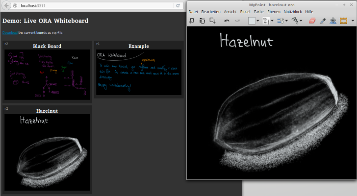

OraWhiteboart provides online-published whiteboards. It reads OpenRaster files and updates them on the web page.

## Installation

    npm install ora-whiteboard

## Usage

    require( 'ora-whiteboard' ).startOraBoard( {
        boardDir: __dirname + '/boards',
        port: 3311
    } );
    
starts a web server listening on `http://localhost:3311/`. OraWhiteboard watches all `.ora` drawings 
in the `boards/` directory and updates them on the index page as soon as they change.
 
You can save new ORA files (e.g. with MyPaint), and they will automatically show up on the web site.

## API

### .startOraBoard( options )

Starts a server listening on the given port.

`options`:

    {
        boardDir: 'boards/',    # Directory path containing ORA files
        port: 3311,             # The server will be listening on this port.
        sharedFs: false,        # If the watched directory is from a share, set it to true.
        interval: 1000,         # Polling interval to check for modifications, if sharedFs is true
        title: 'ORA Board'      # To set a custom title
    }

### .logLevel

Can be set to `warn`, `info`, or `debug`. Example:

    oraWhiteboard.logLevel = 'info';

### Working with network and Virtual Machine shares

Enabling `options.sharedFs` will use `fs.watchFile()` instead of `fs.watch()`, 
which periodically checks for modifications instead of subscribing 
to changes (which is not supported on shared file systems like network shares, or shared folders in VMs).

Disadvantage is that changes are detected with some delay, advantage is that they are detected at all.
